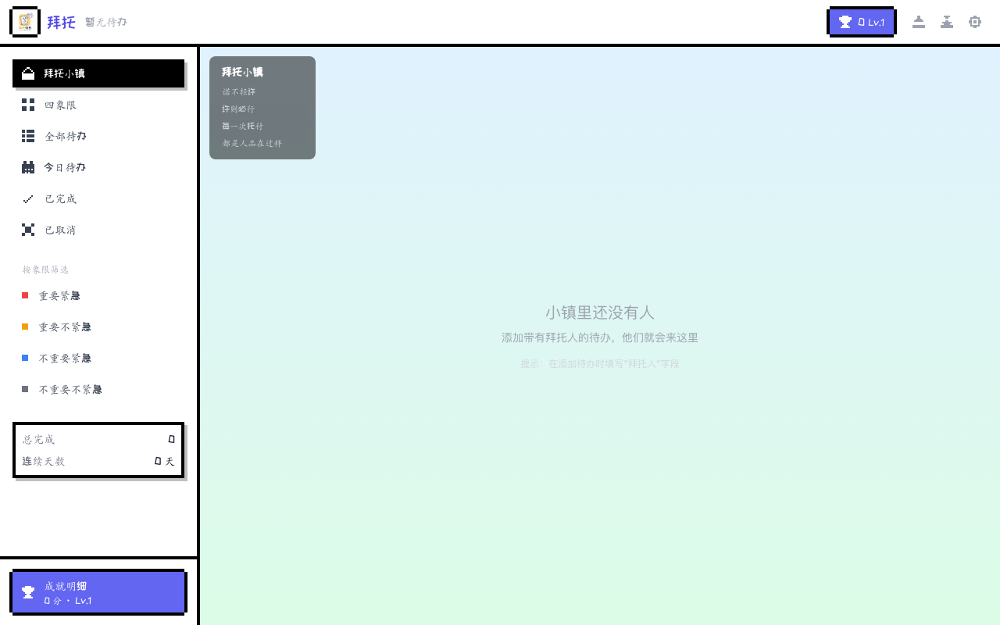
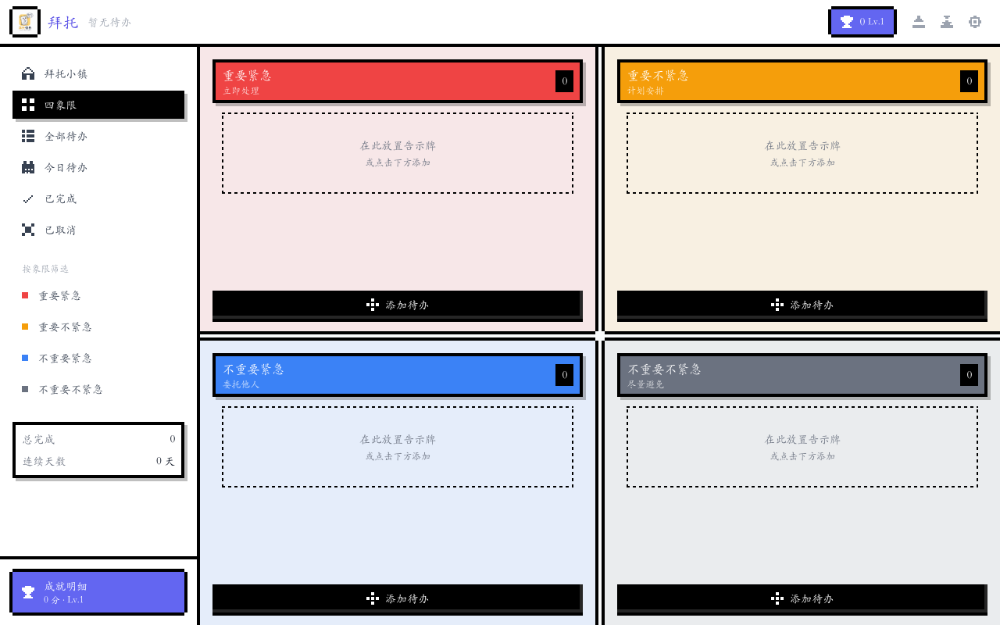
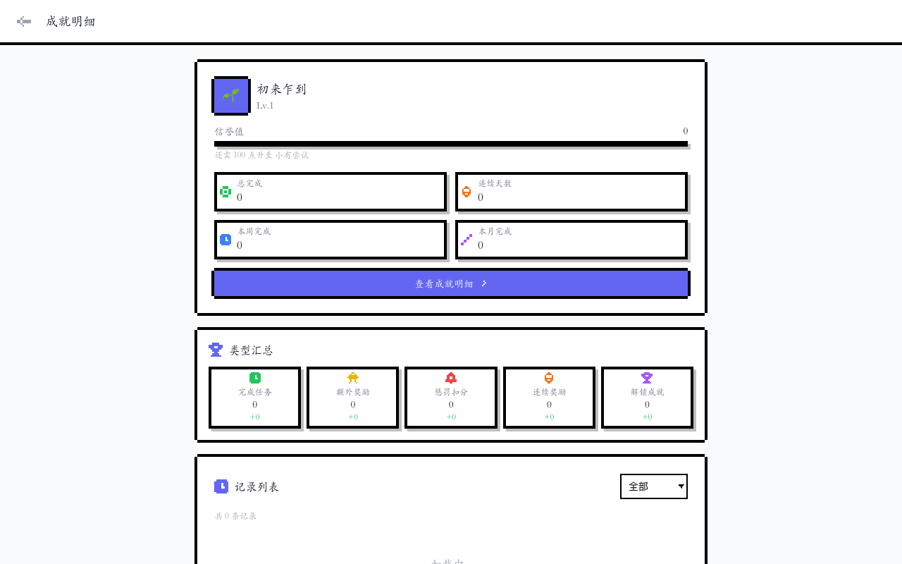

# 拜托 🙏

> 积累信誉，成就自我 —— 把待办变成人脉积累


## 📸 项目截图

### 拜托小镇

把每一条待办变成像素小人在小镇中生活，根据完成情况自动计算情绪。



### 四象限矩阵

艾森豪威尔矩阵的像素化呈现，告别千篇一律的待办应用 UI。



### 成就明细

记录每一次信誉变化的来龙去脉，支持按类型筛选与分页。



## 🎯 项目理念

**拜托**是一个独特的待办管理应用。它把传统的"待办事项"转换成"别人求你办的事"。

- 每一条待办，都是别人对你的信任和依赖
- 每完成一件，你的信誉值就增加
- 完成的越多，说明你人缘越好、人脉越广
- 这不只是待办管理，更是你的人脉积累器

## ✨ 功能特性

### 四象限管理
基于艾森豪威尔矩阵，帮你科学分类：
- 🔴 **重要紧急** - 立即处理
- 🟡 **重要不紧急** - 计划安排
- 🔵 **不重要紧急** - 委托他人
- ⚪ **不重要不紧急** - 尽量避免

### 信誉系统
- 完成任务获得信誉值，根据重要程度和难度计算
- 18个等级从"初来乍到"到"传说"
- 提前完成额外加分，逾期完成扣分
- 每日自动检查逾期任务

### 成就系统
- 10种成就等你解锁
- 完成数量里程碑、连续天数、时间管理大师...
- 成就明细页面记录每一次变化

### 灵活管理
- 拖拽排序和跨象限移动
- 多视图切换（四象限、列表、今日、已完成）
- 本地存储，数据安全
- 支持导入导出

## 🚀 快速开始

### 安装
```bash
git clone https://github.com/opengspace/BaiTuo.git
cd BaiTuo
npm install
```

### 开发
```bash
npm run dev
```

### 构建
```bash
npm run build
```

## 📦 技术栈

- **React 18** - 现代化前端框架
- **TypeScript** - 类型安全
- **Vite** - 极速构建工具
- **Zustand** - 轻量状态管理
- **IndexedDB** - 本地数据存储
- **dnd-kit** - 拖拽功能
- **Tailwind CSS** - 现代样式方案

## 📖 使用场景

- 🤝 **朋友求助** - 记录朋友托你办的事，完成后提升信誉
- 💼 **工作委托** - 同事请求帮忙的任务，积累职场人脉
- 🏠 **家庭事务** - 家人交给你的事，增进家庭关系
- 🌍 **社区服务** - 帮助社区的任务，扩大社交圈

## 🎮 核心概念

| 术语 | 说明 |
|------|------|
| 待办 | 别人求你办的事 |
| 请求人 | 谁求你办这件事 |
| 信誉值 | 完成任务获得的积分 |
| 等级 | 信誉累积后的身份标识 |
| 成就 | 达成特定条件解锁的荣誉 |

## 📊 信誉计算规则

| 象限 | 基础分 |
|------|--------|
| 重要紧急 | 100分 |
| 重要不紧急 | 80分 |
| 不重要紧急 | 60分 |
| 不重要不紧急 | 40分 |

| 难度 | 系数 |
|------|------|
| 简单 | 0.8x |
| 中等 | 1.0x |
| 困难 | 1.5x |

**额外奖励：**
- 提前完成：每小时 +5分（最高 +50）
- 连续完成：3天以上每天 +10分

**惩罚规则：**
- 逾期完成：每小时 -3分
- 取消任务：扣除一定比例信誉值

## 📁 项目结构

```
src/
├── components/        # 组件
│   ├── common/        # 通用组件
│   ├── layout/        # 布局组件
│   ├── reputation/    # 成就相关组件
│   ├── settings/      # 设置组件
│   └── todo/          # 待办相关组件
├── pages/             # 页面
├── services/          # 服务层
│   ├── db/            # 数据库操作
│   └── dailyCheck.ts  # 每日检查服务
├── store/             # 状态管理
├── types/             # 类型定义
└── utils/             # 工具函数
```

## 📝 更新日志

查看 [CHANGELOG.md](./CHANGELOG.md) 了解详细更新记录。

## 📄 许可证

MIT License

---

**拜托** - 让每一次帮忙都成为人脉的积累 🙏